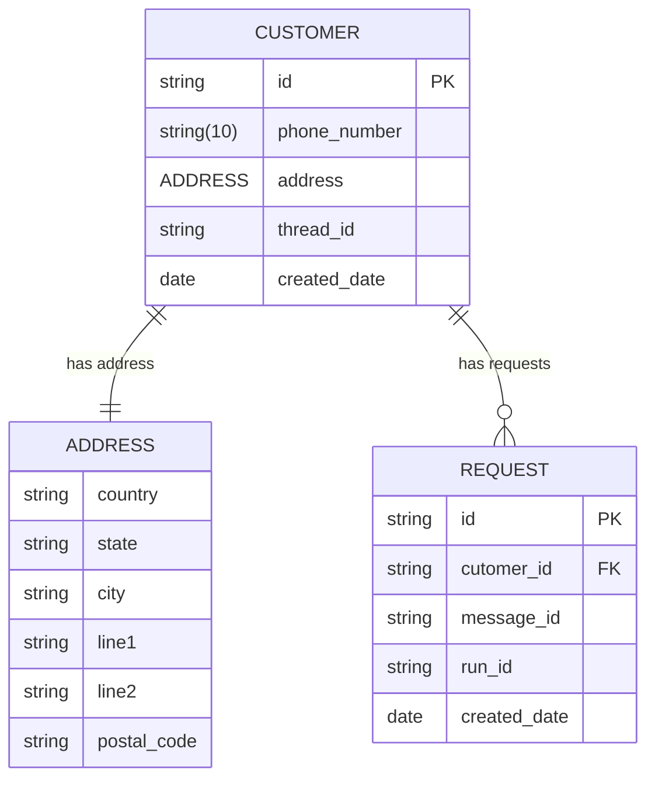

# OrderTaxiChat

OrderTaxiChat is an app for ordering a taxi through conversation with a chatbot. A ChatGPT-based assistant from OpenAI was used to create the chatbot. Which was trained with some instructions in the area of ordering a taxi, taking the address from the customer and registering a new order in the system.

## Technologies

Below is a list of all the technologies used to develop the app. They are structured by categories.

**Frontend**
   - HTML
   - CSS
   - JavaScript
   - **Libraries**
     - Bootstrap
     - Font Awesome 4 Icons
     - jQuery

**Backend**
   - Python
   - Flask

**Databases**
   - MongoDB

**Cloud**
   - [OpenAI Platform](https://platform.openai.com/docs/overview)

## Environment variables

Before running the application, is necessary to set the environment variables used by the application. For this, a file named **.env** must be created. This file will contain all environment variables.

The environment variables that are used by the application are:

```
HOST = "0.0.0.0"
```

The **HOST** variable contains the IP address where the application is running.

```
PORT = 7000
```

The **PORT** variable contains the port where the application is running.

```
CHECK_STATUS_AFTER_SECONDS = 10
```

The **CHECK_STATUS_AFTER_SECONDS** variable is the time after which it need to check again if a message sent to the chatbot has been completed or is still in progress.

```
DATABASE_NAME = "MeridianTaxiChat"
```

The **DATABASE_NAME** variable is the name of the collection in the database where the tables are stored.

```
DATABASE_URL = "<<your connection string>>"
```

The **DATABASE_URL** variable is the MongoDB database connection string.

```
OPENAI_API_KEY = "<<your API key>>"
```

The **OPENAI_API_KEY** variable is the key API service of the OpenAI platform.

```
OPENAI_ASSISTANT = "<<your assistant key>>"
```

The **OPENAI_ASSISTANT** variable is the key to the assistant built on the OpenAI platform.

## Run & Build commands

The application is developed using the Flask framework.

Before executing any command, we must make sure that the packages are installed, otherwise we must install them using this command:
```
pip install -r requirements.txt
```

To run the application in the development mode use this command:
```
python server.py
```

## Management of Folder & Files

The project is structured as follows:

- [Assets](https://github.com/EddyEduard/OrderTaxiChat/tree/main/assets) used for storing static files (CSS, JS, images);
- [Controllers](https://github.com/EddyEduard/OrderTaxiChat/tree/main/controllers) used to control actions in the application;
- [Helpers](https://github.com/EddyEduard/OrderTaxiChat/tree/main/helpers) used to store useful functions;
- [Models](https://github.com/EddyEduard/OrderTaxiChat/tree/main/models) are used for modeling database tables;
- [Routers](https://github.com/EddyEduard/OrderTaxiChat/tree/main/routers) contains all routers between controllers and models;
- [Services](https://github.com/EddyEduard/OrderTaxiChat/tree/main/services) contains the main chat and chatbot services;
- [Templates](https://github.com/EddyEduard/OrderTaxiChat/tree/main/templates) contains the web pages;
- [Utils](https://github.com/EddyEduard/OrderTaxiChat/tree/main/utils) containing some useful functions.

## Features & Functionalities

The chatbot can execute the next tasks:

1. Have a friendly and decent conversation with the customer;
2. Ask for the address of the order;
3. Ask about the date and time of the taxi dispatch;
4. To ask about method of payment;
5. Record the order in the system.


## Database

The database used for data storage is [MongoDB](https://www.mongodb.com/).

## System Diagram

### Entity Relationship Diagram



## License
Distributed under the MIT License. See [MIT](https://github.com/EddyEduard/OrderTaxiChat/blob/master/LICENSE) for more information.

## Contact
EddyEduard - [eduard_nicolae@yahoo.com](mailTo:eduard_nicolae@yahoo.com)
\
Project link - [https://github.com/EddyEduard/OrderTaxiChat](https://github.com/EddyEduard/OrderTaxiChat.git)
